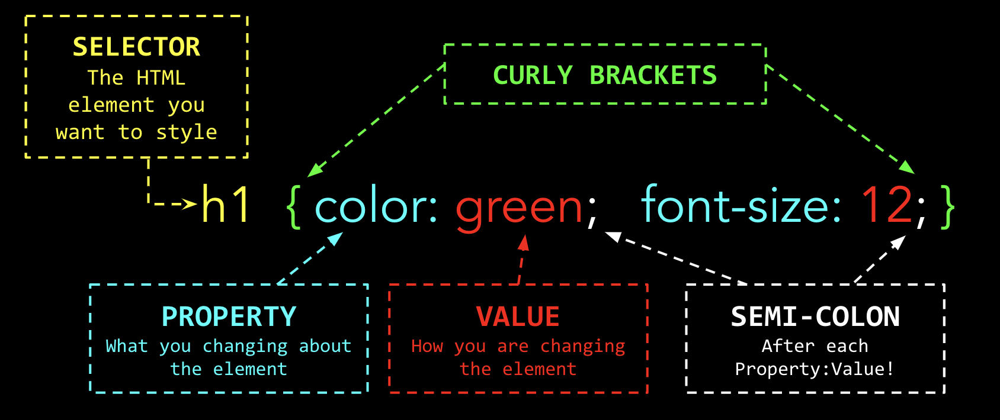

# Adding Style with CSS

Instead of styling HTML elements "in-line" or in the opening tag you can use **CASCADING STYLE SHEETS or CSS for short.**

In your file tree you will find a css file: ```style.css```

**Nested inside the head tags, you may have noticed this code:**

```<link href="style.css" rel="stylesheet" type="text/css" />```

This is called the External Resource Link Element.  It links your HTML page with a specific style sheet. A website can have multiple style sheets.

## Task 1

In the ```index.html``` file,  you will find code for the Grilled Cheese Recipe.

Locate the ```style.css``` file in the file tree. Click on the file.

## Task 2

With a style sheet, you can change the style of multiple elements at once.  **CSS Values are written the same way you wrote values using the style attribute.**

**CSS Syntax looks like this:**



Type the following code into your style sheet.:

```
p {
 color:#986A33;
}
```

Run the code. All of your ```<p>``` elements should be a dark brown.  The code you added is called a **rule set**.

Now add this property to change the font:

```
p {
 color:#986A33;
 font-family:sans-serif;
}
```

**NOTE** Each property is seperated by a semi-colon.  Also, note  the formatting of youR CSS code. Hit return and go to a new line whenever you add a new property.

## Task 3

At the end of the second paragraph, there is a  ```<span>``` element with the  words "Source:  Wikipedia".  You can use CSS to make those words italics.  In the style sheet add a  new CSS ruleset like this:

```
span {
  font-style: italic;
}
```
## Task 4

You can use online resources to explore various CSS properties. Click the link below for CSS properties that control the body of your HTML page.

[CSS Body Properties](https://www.w3schools.com/css/css_background.asp)

Change the background color of the **body** of your page using CSS.  What would be the selector? Look at your previous lessons as a reminder of how the background color-roperty and value  should be written.


## Task 5

Click the links below to explore some CSS properties for text and fonts:

[CSS Text Properties](https://www.w3schools.com/css/css_text.asp)

**Change the colors of the Heading ```<h1>``` and Subheading ```<h2>``` in the  CSS File.**

## Task 6

Explore common text alignment properties:

[CSS Text Alignment Properties](https://www.w3schools.com/css/css_text_align.asp)

**Center the Heading ```<h1>``` and Subheading ```<h2>``` of your page.**

## Task 7

Explore common font  properties:

[CSS Font family](https://www.w3schools.com/css/css_font.asp)
[CSS Font Style](https://www.w3schools.com/css/css_font.asp)
[CSS Font Size](https://www.w3schools.com/css/css_font.asp)

**Change the font size of the ```<h1>``` element to ```48px```**<br>

**Change the font size of the ```<h2>``` element to ```24px```**<br>

**Choose a font-family from the link above and change the font-family of the```<h1>``` and ```<h2>``` on your page.**


## Task 8

You can use CSS to resize images by changing the width.  You can either type a specific pixel size or a percentage of the original size.

```
img {
  width: 250px;
}
```
or
```
img {
  width: 50%;
}
```

**Reduce the size of the image by 50%.**

## Task 9

Click the link below to explore some **common image properties**:

[CSS Image Properties](https://www.w3schools.com/css/css3_images.asp)

**Center the image.**


## Task 10

You can add borders to any object using CSS.

Add this to your CSS to create borders around your images:

```
img {
  border: 15px solid orange;
}
```
```border``` is the property. You need 3 values to make a border appear. 

```15px``` is the border's thickness in pixels.<br><br>
```solid``` is the border's style. Other styles include ```dashed```, ```dotted``` and ```double```.<br><br>
```orange``` is the color of the border.<br><br>

The three values are separated by a space, with a semi-colon after the last value.

## Task 11

Click the link below to explore some **common border properties**:

[CSS Border Properties](https://www.w3schools.com/css/css_border.asp)<br>
[CSS Border Width Properties](https://www.w3schools.com/css/css_border_width.asp)<br>
[CSS Border  Properties](https://www.w3schools.com/css/css_border_width.asp)<br>
[CSS Border Individual Sides Property](https://www.w3schools.com/css/css_border_sides.asp)<br>
[CSS Rounded Border Properties](https://www.w3schools.com/css/css_border_rounded.asp)<br>

**Make the borders around your image rounded**


----
**CSS makes styling elements on your HTML page easier and it keeps your HTML code clean and simple! Save this assignment as a reference.**

You can use **W3 Schools** as a reference for CSS properties.  Link is below:

[W3 Schools CSS Reference](https://www.w3schools.com/css/default.asp)

----

 